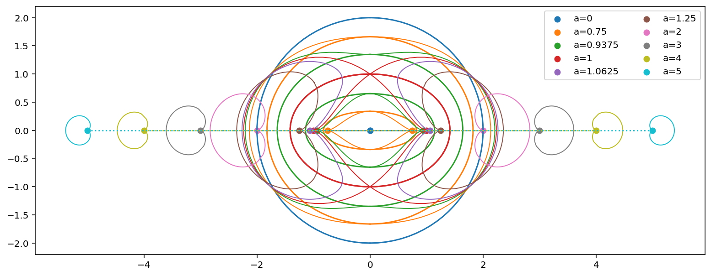

# `Fadge`

Fast Automatic Differential GEometry (`Fadge`) is a flexible and
high performance differential geometry package that uses python's
dynamic features and [Google JAX](https://github.com/google/jax)'s
automatic differentiation.

